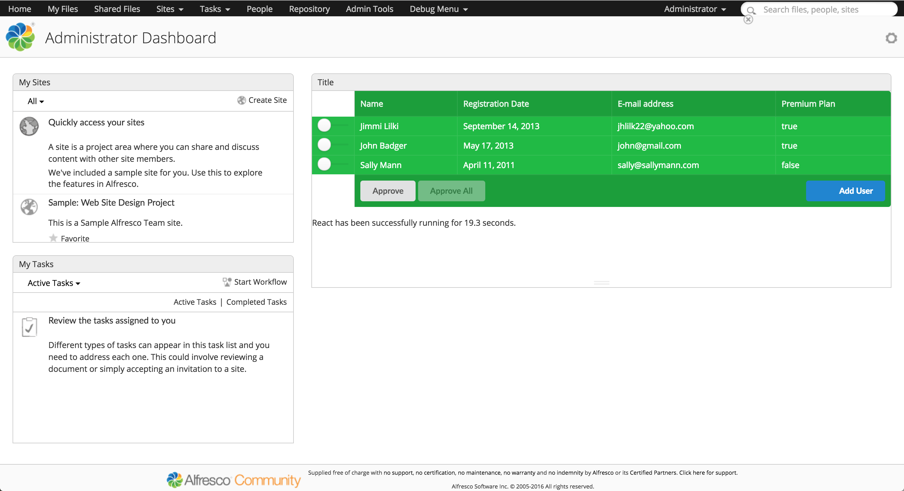

# Alfresco Share ReactJS

This is a starter project for those wishing to make a ReactJS
application inside the Alfresco Community ECM and was created
initially for a hackathon project for
[BeeCon 2016](http://beecon.buzz/). It was made by using the
[Alfresco AIO tutorial](http://docs.alfresco.com/5.1/tasks/alfresco-sdk-tutorials-all-in-one-archetype.html)
namely, the alfresco-aio archetype was install using maven. Then, the
demoamp code for the application was removed.

# Why?

Modern web application development have turned to using
[JavaScript MVC](http://alistapart.com/article/javascript-mvc)
frameworks to provide structure on top of vanilla JavaScript and
provide useful features.

ReactJS is one such JavaScript MVC and is particularly useful because
it just represents _just_ the "View" part of MVC. This allows the
developer to re-use controller and model logic within a project such
as Alfresco Community or make use of other controller and model
libraries to suit their needs. A full feature list of ReactJS as well
as further documentation [can be found here](https://facebook.github.io/react/).

Heck, even Alfresco One wants to move to AngularJS at some point!

# Getting started

Clone the repository and start the runner

```bash
git clone https://github.com/rubble/alfresco-share-reactjs && cd alfresco-share-reactjs && sh run.sh
```

... this may take a while! (It took 3-4 minutes on my 2014 MBP). What
it will do is grab all the dependencies for Alfresco, build all the
source files, place them in the `runner/` and startup Apache-Tomcat and Solr.

Once loaded, login at `127.0.0.1:8080/share` and use the default
username/password `admin/admin`. Click on the dashboard cog, add the
dashlet and you should see:



Yay!

# Developing

The dashlet code follows the conventions for creating and authoring
[Aikau Dashlets](http://docs.alfresco.com/5.1/concepts/dev-extensions-share-aikau-dashlets.html).
The entry point for the react widget is located at:

```bash
alfresco-share-widget-reactjs/share-reactjs/share-reactjs-share-amp/src/main/amp/web/js/react-widget/dashlets/widgets/ReactWidget.js
```

The main guts of the program, however, are found in:

`./JSX/JSXcomponents/`

You'll need to _compile_ JSX into ES5 JavaScript to get it to work
so:

```bash
cd JSX/
npm install  # this grabs babel, babel-es5 and react
babel --watch JSXComponents.jsx --out-file JSXComponents.js --presets react
```

_Then_ you'll need to symlink this into the `widgets` directory.
 
```bash
ln -s JSXcomponents.js /Users/emlyn/vidirepo/alfresco-share-widget-reactjs/share-reactjs/share-reactjs-share-amp/src/main/amp/web/js/react-widget/dashlets/widgets/JSXcomponents.jsx
```

Not particularly smooth, I know, but this was a hackathon project so 
your lucky there is any documentation! Have fun!